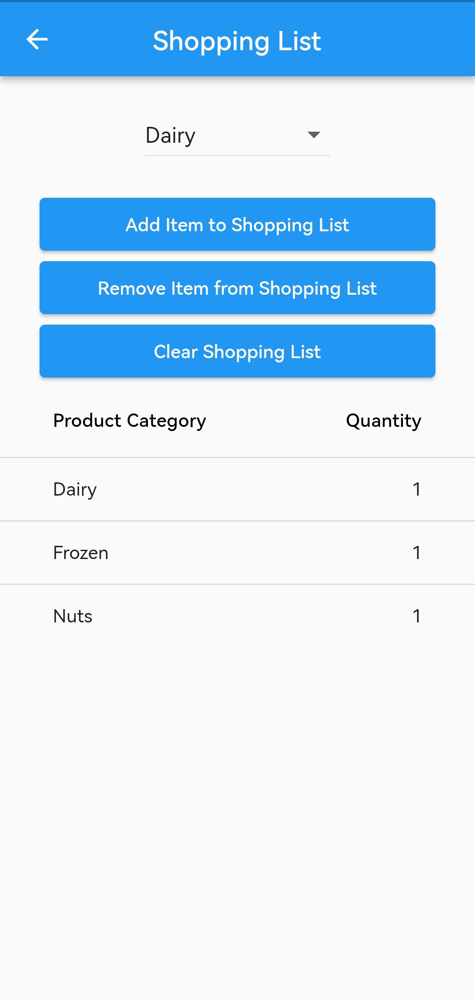
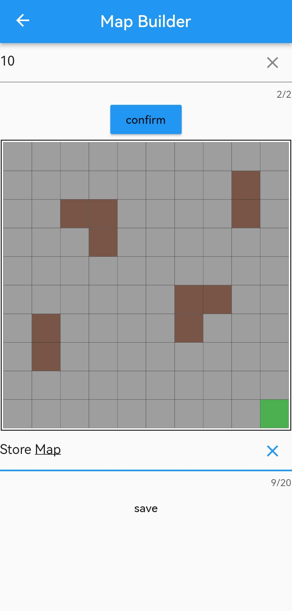
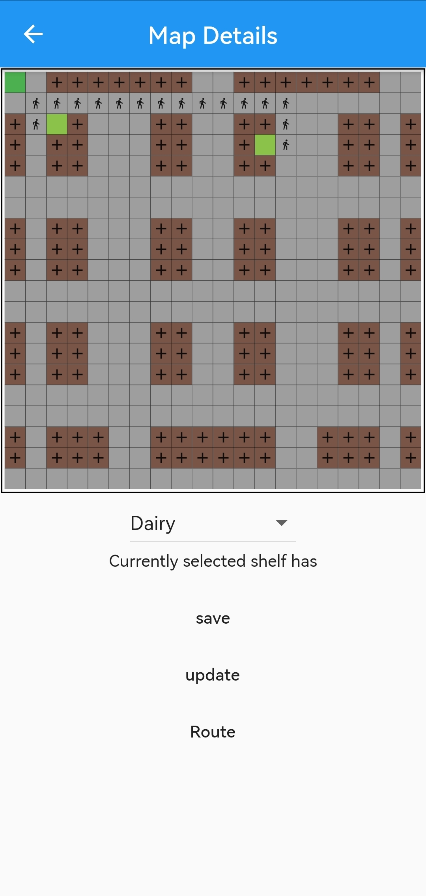
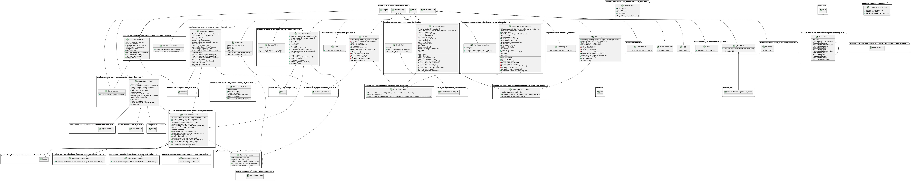

  

# mapket
An Android App designed to help you find what you need in grocery stores.

Built in flutter in combination with firebase its easy to get going and modify for your own needs.

# Shopping list 
Shopping list consisting of pre-defined product categories.

# Map Builder 
Adding your own stores is easily done with the built-in map editor.

# Navigation
The navigation uses the maps and products added to the shopping list to create the shortest path from product to product.
It then displays them in a step by step manner to ease in navigation.

# UML

